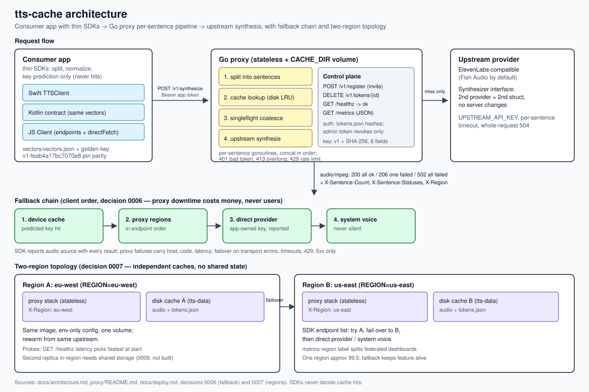

[](https://github.com/anq-no-one/tts-cache/actions/workflows/ci.yml)
# tts-cache

Self-hosted caching proxy for ElevenLabs-compatible TTS APIs that serves repeat sentences from disk instead of paying to synthesize them again.

## When to use / when not

Use it when your app repeats the same spoken phrases (coach cues, prompts, announcements) and you pay per character upstream: repeats become cache hits, new sentences are synthesized once and stored.

Do not use it when every utterance is unique (no repeats means no savings), when you need byte-identical streaming from the provider, or when you cannot run a service with a writable cache volume plus a provider key for cache misses.

## 60-second quickstart

Needs Docker with compose and a provider key for an ElevenLabs-compatible upstream (Fish Audio format by default).

```sh
cd proxy
UPSTREAM_API_KEY=<provider-key> INVITE_CODES=<pick-a-code> ADMIN_TOKEN=<pick-a-secret> REGION=eu-west \
  docker compose up --build -d
curl localhost:8080/healthz
```

Register one app token (needs the invitation code; the raw token is shown once):

```sh
curl -s -X POST localhost:8080/v1/register \
  -H 'Content-Type: application/json' \
  -d '{"invitation_code": "<pick-a-code>", "app_name": "my-app"}'
```

Synthesize (token goes in the header; both `text` and `voice_id` are required):

```sh
curl -s -X POST localhost:8080/v1/synthesize \
  -H "Authorization: Bearer <app-token>" \
  -H 'Content-Type: application/json' \
  -d '{"text": "Hello. World.", "voice_id": "<voice>"}' \
  -o out.mp3
curl -s localhost:8080/metrics
```

Repeat the synthesize call and watch `cache_hits` rise in metrics: that is the cache working. Responses carry `X-Sentence-Count`, `X-Sentence-Statuses`, `X-Region`, and `X-Cache-Key-Version`. Every route, header, and env name above matches `proxy/internal/http/server.go`, `proxy/cmd/server/main.go`, and `proxy/docker-compose.yml`.

## SDKs

| SDK | Path | Maturity |
|---|---|---|
| Swift | `swift/` | Reference client: key parity plus latency-ranked failover (`TTSClient`). |
| JS | `js/` | Full client: key parity plus `Client` with memory cache, failover, and `directFetch` hook. |
| Kotlin | `kotlin/` | Contract plus fetch: vectors/golden-key parity with `fetchSynthesize` over `HttpURLConnection`, no failover client yet. |

Every SDK pins parity through `vectors/vectors.json` and the golden key `v1-feab4a17bc7070e8`. Client-side sentence splitting is UX only; the server sentence list is authoritative.

## Architecture



## Docs

- `docs/deploy.md` — fresh host to serving audio, full env reference.
- `docs/architecture.md` — request flow, cache, tokens, regions.
- `docs/faq.md` — cost, quality, auth, eviction, regions, SDK parity.
- `docs/decisions/` — accepted decisions 0001 to 0009.
- `proxy/README.md` — API and config details.
- `examples/` — runnable curl, JS, and Swift samples.

## License and contributing

MIT, see `LICENSE`. Contributor notes in `CONTRIBUTING.md`: vectors plus golden key stay green in every suite, `/v1/synthesize` only ever gains additive fields, and behavior changes arrive with a new file in `docs/decisions/`.
