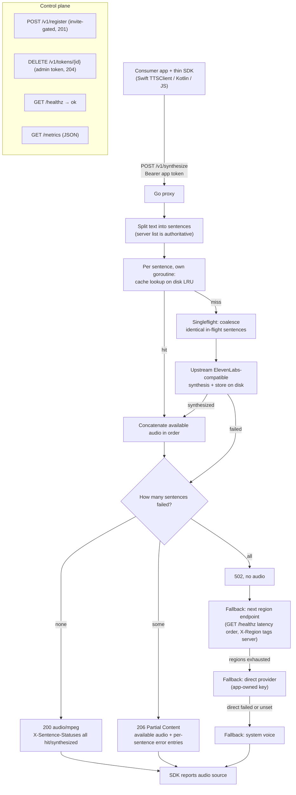

# Architecture

## Code architecture

Request flow through the proxy (`proxy/internal/`):

- `http` — routes, auth checks, rate limits, fan-out.
  - `POST /v1/synthesize` splits text into sentences, processes each
    sentence in its own goroutine, concatenates the audio that is
    available, in order.
  - `POST /v1/register` issues app tokens (invitation code required,
    `201`). `DELETE /v1/tokens/{id}` revokes (admin token required,
    `204`). `GET /healthz` answers `ok`. `GET /metrics` answers JSON.
- `cache` — disk store keyed by `v1` + SHA-256 over six sound fields
  (normalized text, voice, model, speed, format, language).
  Byte-capped LRU eviction via `CACHE_MAX_BYTES`, eviction counter in
  metrics.
- `upstream` — `Synthesizer` interface with one implementation,
  `ElevenLabsCompat`. Second provider means a second struct behind
  the same interface, no server changes.
- `auth` — token store rooted at `CACHE_DIR` (`tokens.json`, hashes
  only). Invitation codes gate registration; bearer tokens gate
  synthesis; the static `ADMIN_TOKEN` gates revocation.

Per-sentence isolation:

- One slow or failed sentence never blocks the rest. Each sentence is
  an independent cache lookup plus optional upstream call.
- Responses carry `X-Sentence-Count` and `X-Sentence-Statuses`. The
  server sentence list is authoritative; client-side splitting is UX
  only.
- One failed sentence: `206` with available audio. All failed: `502`.

Concurrency and caching:

- `callGroup` (`http/group.go`) coalesces identical in-flight
  sentences. Ten concurrent misses for the same sentence synthesize
  once.
- LRU evicts least-recently-read clips when `CACHE_MAX_BYTES` is set.
  `0` means unlimited. `evictions` and `cache_bytes` expose it in
  metrics.
- SDKs (`swift/`, `kotlin/`, `js/`) own splitting, normalization, and
  key computation for prediction, but never decide cache hits. Key
  parity is pinned by `vectors/vectors.json` plus the golden key
  `v1-feab4a17bc7070e8`, checked by every suite.

Token model:

- Invitation code: one-time gate at registration, from `INVITE_CODES`.
- App token: per-app bearer for synthesis, revocable by id.
- Admin token: single static secret for revocation only.

## Deployment architecture

- Stateless service plus one cache volume. `CACHE_DIR` (audio plus
  `tokens.json`) is the only state. Code, config, and image are
  replaceable at any time.
- Single host plus compose is the minimal topology: one container,
  one named volume (`tts-data`). See `docs/deploy.md`.
- Region labels with independent caches. Each stack sets its own
  `REGION`, served back as the `X-Region` header and `region` metric.
  Regions share nothing and rewarm from the same upstream.
- Endpoint failover is measured in the SDKs. Clients hold an ordered
  endpoint list, probe `GET /healthz` for latency, try regions in
  order, and fall back to direct provider or system voice before
  going silent.
- What a second region needs: run one stack per region with a
  distinct `REGION`, publish both endpoints to the SDKs. No shared
  state required. A second live region is still gated (see
  `docs/decisions/0009-shared-storage.md`).
- What horizontal scale inside one region needs: the shared-storage
  change from `0009` (common object storage behind the current store
  interface), then two or more hosts behind any TCP load balancer.

## Diagrams

See `docs/architecture.svg` for the overview picture (request flow,
fallback chain, two-region topology). The flowchart below covers the
synthesize path including partial `206` and the client fallback.

